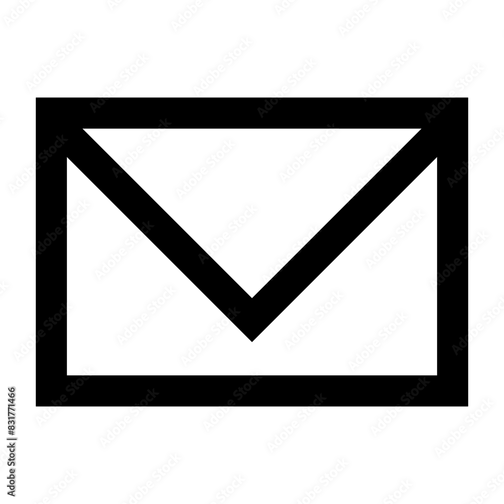

# Machine Learning Engineer
## AI Agents and Natural Language Processing 

 

## TECHNICAL SKILLS

  
<strong>Languages & Tools</strong>

  <ul>
    <li><strong>Programming Languages:</strong>
      <ul>
        <li>Python</li>
        <li>C++</li>
        <li>SQL</li>
      </ul>
    </li>
    <li><strong>Tools & Platforms:</strong>
      <ul>
        <li>Spark</li>
        <li>Google Cloud Platform (GCP)</li>
        <li>Tableau</li>
        <li>Teradata</li>
        <li>MicroStrategy</li>
        <li>Grafana</li>
        <li>JIRA, Confluence</li>
      </ul>
    </li>
  </ul>

  
<strong>Frameworks & Libraries</strong>

  <ul>
    <li>NumPy</li>
    <li>Pandas</li>
    <li>Matplotlib</li>
    <li>XGBoost</li>
    <li>Scikit-learn</li>
    <li>PyTorch</li>
    <li>PyMC</li>
    <li>TensorFlow</li>
  </ul>

  
<strong>Core Competencies</strong>

  <ul>
    <li>Data Mining</li>
    <li>Visualization</li>
    <li>Machine Learning</li>
    <li>Deep Learning</li>
    <li>Database Management</li>
    <li>Distributed Computing</li>
  </ul>

 

## EDUCATION

**University of Illinois**  
MS Computer Science

  
<em>Relevant Coursework</em>

  <ul>
    <li>Machine Learning</li>
    <li>Data Science</li>
    <li>Computer Algorithms</li>
    <li>Natural Language Processing</li>
    <li>Energy Efficient Deep Learning</li>
  </ul>

 

**Institute of Business Administration**  
BS Computer Science

  
<em>Relevant Coursework</em>

  <ul>
    <li>Machine Learning</li>
    <li>Deep Learning</li>
    <li>Natural Language Processing</li>
    <li>Computer Vision</li>
  </ul>

 
 

## WORK EXPERIENCE

**Argonne National Laboratory** | Lemont, USA &nbsp;   
**Graduate Researcher** | Jan 2025 – May 2025  
- Developed an automation tool that can potentially reduce literature survey time from weeks to hours
- Generated vector embeddings of parsed text and images to facilitate semantic search and similarity-based retrieval
- Built a graph database using Memgraph to represent extracted content, enabling intuitive knowledge exploration through entity relationships
- Leveraged LLMs to automatically populate the graph database with entities, relationships, and key insights, streamlining the knowledge graph construction process
- Designed a Python-based pipeline for end-to-end literature survey automation, reducing manual effort by 70%
 

**Bookassist** | Madrid, Spain &nbsp;   
**Data Scientist** | Nov 2023 – Jul 2024  
- Built a hotel recommendation engine in Python, driving an increase in revenue by optimizing suggestion accuracy
- Achieved 2-second recommendation times by leveraging embeddings and a vector database
- Employed Vertex AI Function Calling on Google Cloud Platform (GCP) to extract structured data from over 10,000 hotel room listings, enabling advanced search and filtering capabilities
- Developed a Docker-based cron job for automated embedding updates, ensuring up-to-date recommendations by running updates 4 times monthly without manual intervention
 

**HR Lytic** | London, UK &nbsp;   
**Machine Learning Engineer** | Mar 2021 – Apr 2023  
- Developed backend microservices in Python Flask for a job search platform, supporting scalable job matching
- Extracted structured data from resumes using regex and part-of-speech tagging, achieving 80% parsing accuracy
- Created custom word embeddings tailored for resumes, incorporating 500 specialized technology terms
- Implemented recommendation algorithms for precise job-candidate matching, significantly enhancing relevance by suggesting roles that matched candidate profiles with 70% accuracy
- Created an intelligent chatbot to assist recruiters, accelerating candidate inquiries by 50% and automating interview scheduling, while using MongoDB to efficiently store and retrieve candidate data
- Developed a CNN-based image recognition model to identify duplicate entries in the database, achieving 95% accuracy and significantly reducing data redundancy
 
 

## PROJECTS

#### AutoFloor, Floorplan Generator  
- Fine-tuned a diffusion generative AI model which generated floor plans from text inputs in less than 5 seconds
- Optimized the model to run on a 4 GB GPU, reducing operational costs and increasing accessibility
- Prepared a dataset of 30,000 floor plan images, including color-coded rooms, to enhance model accuracy
 

#### Medical QA, Medical Chatbot  
- Developed a Retrieval Augmented Generation (RAG) medical chatbot using embedding and Large Language Models
- Enabled real-time responses to user queries, scanning over 1,000 medical research papers in under 3 seconds
- Deployed code using Docker, Kubernetes, and Jenkins, achieving 100% automation of seamless CI/CD pipelines
 

#### Report IT, Crime Reporting Web Application  
- Developed a scalable web application using JavaScript and Express JS, adhering to the MVC architecture, which supported over 1,000 users while maintaining performance as the user base expanded
- Implemented Google Maps API for real-time location-based crime reporting, refreshing every 30 seconds to provide up-to-date data
- Integrated a clustering algorithm to find crime hot spots, delivering safe route recommendations with 80% accuracy
 
 

## LEADERSHIP EXPERIENCE

**IBA Data Science Society** | Executive Council Member | Aug 2022 – May 2023  
- Organized and supervised a machine learning competition with 50 participants and 10 judges
- Secured sponsorship from 3 companies, providing free entry for students and offering cash prizes
 

**Institute of Business Administration** | Artificial Intelligence Teaching Assistant | Jan 2023 – May 2023  
- Automated the assignment grading process, delivering fair and timely feedback to a class of 40 students
- Offered personalized support to students, leading to enhanced understanding and academic improvement
 

**JDC Foundation** | Community Volunteer | June 2022 – July 2022  
- Built meaningful connections with elderly residents at JDC Old Home, fostering a welcoming atmosphere
- Contributed to JDC Dastarkhan, helping to feed people and promoting community engagement
 
 

## CONTACT

Feel free to reach out to me through the following channels:  
**** [smahm38@uic.edu](mailto:smahm38@uic.edu)  
**** [https://www.linkedin.com/in/saad-riazuddin-mahmood-663037200/](https://www.linkedin.com/in/saad-riazuddin-mahmood-663037200/)

